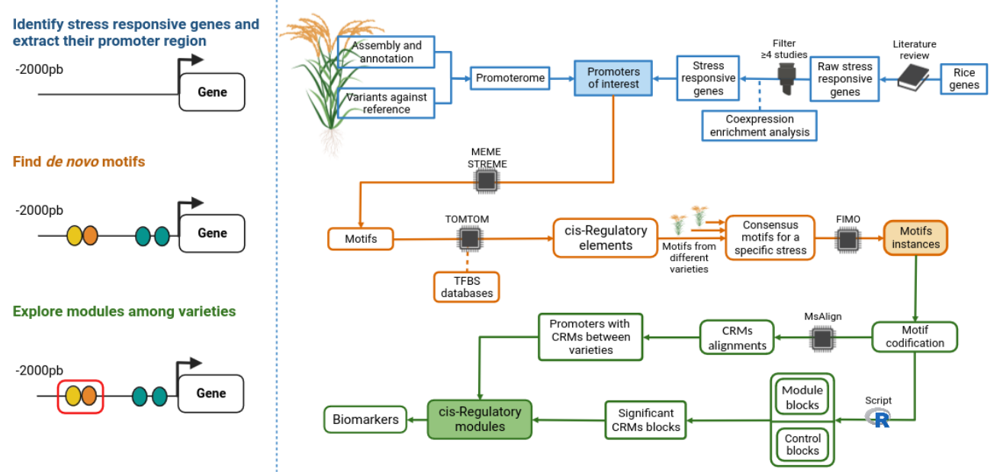

# riceBreedingProyect (Finding cisRegulatory Modules in regulatory gene sequences)

## 1) Description
Resistance to multiple stresses in plants is achieved through effective modulation and coregulation of response genes. When expressed in a timely manner, these genes enhance the plant's ability to survive in hostile environments, including heat stress conditions (e.g., high temperatures due to climate change) and broad-spectrum diseases. The differential role of a gene in stress responses is associated with variants located in regulatory elements within the promoter region, known as cis-regulatory elements (CREs). These motifs are non-coding short DNA sequences that can regulate gene expression by serving as binding sites for transcription factors (TFBS). A specific combination of these CREs results in increased transcript production of the candidate gene. This grouping of CREs, also called cis-regulatory modules (CRMs), can be conserved across the promoters of different target genes and can be introgressed into rice cultivars of agronomic interest. In this study, we used an in silico approach to discover CRMs present in specific genes related to resistance against high temperatures and broad-spectrum pathogens in different rice varieties. Given the necessary inputs for this approach—genome sequences and lists of functional genes—our method can be applied to the study of other plant species and a wide range of environmental stresses. The rice motifs and modules identified could serve as valuable guides for crop improvement programs and provide a useful starting point for strategies to enhance stress resistance in rice. 

If u want to run any of the process presented here, you can download multiple entries that work as and example of all the script executed here. For this, please visit this [link](https://drive.google.com/drive/folders/17W0wf1kNo0ybJfgwDUOdHiROsG1Hun0x?usp=sharing).
